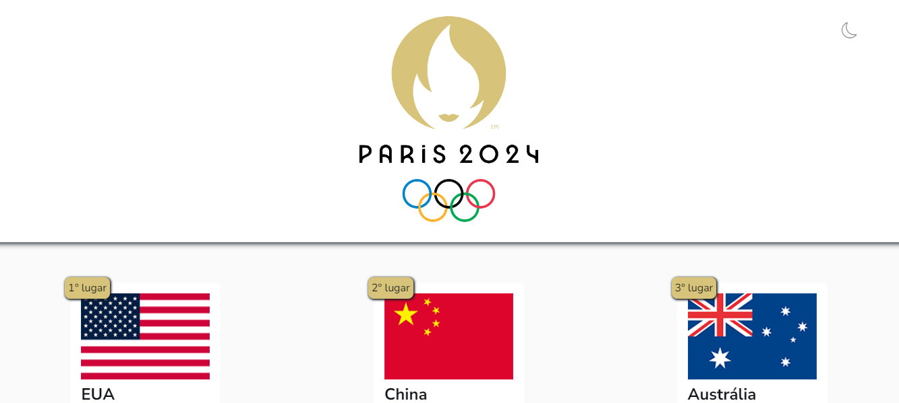

# Projeto Hackathon das Olimpíadas de Paris 2024

Este é o resultado do desafio proposto pela Codante, que consistia em consumir um API pública relativa as olimpiadas, e criar uma aplicação Web relacionada ao tema.

Escolhi desenvolver um quadro de medalhas dos cinquenta melhores países do ranking, utilizando um design moderno, minimalista e responsivo para diversos aparelhos.

## Screenshot

## Links

- Solution URL: [Repository](https://github.com/aslinsjr/mp-hackathon-olimpiadas)
- Live Site URL: [Page](https://mp-hackathon-olimpiadas-five.vercel.app/)

## Desenvolvido com

- HTML5
- CSS3
- React.JS

## Autor

- Linkedln - [Alexandre Lins](https://www.linkedin.com/in/aslinsjr/)
- Instagram - [@alexandrelinsjr](https://www.instagram.com/alexandrelinsjr/)
- Frontend Mentor - [@aslinsjr](https://www.frontendmentor.io/profile/aslinsjr)

